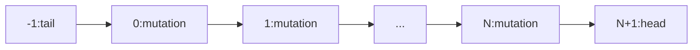
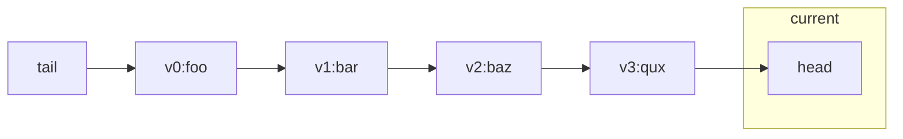
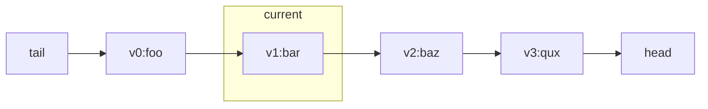
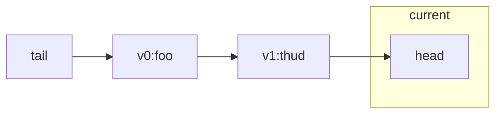

VENT BASICS
===========

Core Concepts
-------------

VENT is build around the following concepts:

* `Entities`, an entity is any object implementing the `IEntity` interface consisting of an `int Id` and implements the `ICloneable` interface. Entities that don't need much more than a `MemberwiseClone` can derive from the `EntityBase` class.

* `an Entity Registry`: a container of all objects relevant to the application and offering operations on these objects. Operations include:
  * registration and de-registration of new entities,
  * Iteration over added entities.

The underlying assumption is that all objects managed by the `Entity Registry` are either entities OR objects which are fully owned by an entity. References in entities to objects outside the `Entity Registry` or objects contained in other entities are not forbidden but may introduce side-effects and are discouraged.

Note that the registry is an entity itself. Registries can be contained inside registries.

* `a History System`, an object managing versioning objects in a given registry. Operations include:
  * committing and reverting entities.
  * undo / redo to get the state of the associated EntityRegistry as contained in a previous/future state.

* `Mutations`, entities capturing modifications to the `EntityStore`.

* `Versioning logs`, entities capturing the lifecycle of other entities.

* `Head state`, the "head state" of an entity is the current working version the application may have of an entity. The application can use and change this version as needed. However a History System can change this version as well when undo/redo or deregister is called on the store. Think of it as the current file version in git, it can be changed as needed, but when  the changes are reverted, git will change the contents of this version.

* `EntityStore or store`, the entity store as used in the rest of the document is the combination of a `History System` and an `Entity Registry`.

Using VENT
----------------------

VENT keeps copies of entities in memory only when the user indicates they want a version of the current state stored or when an entity is first added or removed (entry and exit states). These copies are the result of calling the `Clone` method. Entities can implement the clone method and use `MemberwiseClone` for shallow copies or use the `CopyPropertiesFrom` extension method to create deep copies. Entities with simple data, like a single string or int can use the included `PropertyEntity`.

#### Simple commit example
```csharp
// create a new store
var registry = new EntityRegistry();
var store = new HistorySystem(registry);

// commit an entity to the store to track information
var ent = store.Commit(new PropertyEntity<string>("foo"));
```

At this point the entity store will contain the following data:

* ent: the head version
* ent-version-0: a clone of ent at the time of the commit
* ent-version-info: a log of all the versions of ent, currently only containing ent-version-0
* a mutation capturing the type of mutation (commit) and which entity has been committed (ent).

Subsequent commits will add more versions to the store, ie:

#### Example: Additional commits
```csharp
// change the entity (head)
ent.Value = "bar";

// commit the current entity state
store.Commit(ent);
```
After the second commit, the entity store will contain the following data:

* ent: the head version
* ent-version-0: a clone of ent at the time of the first commit ("foo")
* ent-version-1: a clone of ent at the time of the second commit ("bar")
* ent-version-info: a log of all the versions of ent, currently only containing ent-version-0
* two mutations capturing both commits

If we want to undo and go back into the history we can call `Undo`, ie:

#### Example: Undo (see ReadMeTests.BasicCommitUndoExample)
```csharp
// change the entity value
ent.Value = "qez";

// first undo
Assert.IsTrue(store.Undo());
Assert.AreEqual("bar", ent.Value);
```
Undo will return a `bool`. When it returns `true`, more undo mutations can be called. When it returns `false`, the end of the stored mutations has been reached (the "tail").

At this point ent's Value is set reverted to _"bar"_ again. Note that since "qez" was never committed, we cannot restore this value. Let's continue...

#### Example: Undo Undo (see ReadMeTests.BasicCommitUndoExample)
```csharp
Assert.IsTrue(store.Undo());
Assert.AreEqual("foo", ent.Value);
Assert.IsTrue(ent.Id >= 0);
Assert.IsTrue(store.Registry.Contains(ent));

Assert.IsFalse(store.Undo());
Assert.AreEqual("foo", ent.Value);
Assert.IsTrue(ent.Id == -1);
Assert.IsFalse(store.Registry.Contains(ent));
```

We can continue to undo the current state until `Undo` returns false. At this point all entities have been removed from the store, returning to a somewhat pristine state, except for all the entity version information and different incantations of the entities once present in the store.

To get back to the non-pristine state, you can use `Redo`. Like `Undo` the first `Redo` will appear to do nothing. The second call will add the entity back to the store (we'll get back to this later).  The second `Redo` will restore the second value, _"bar"_.

### Example: Redo (see ReadMeTests.BasicCommitUndoExample)
```csharp
// redo will seem to do nothing
Assert.IsTrue(store.Redo());
Assert.AreEqual("foo", ent.Value);
Assert.IsTrue(ent.Id == -1);
Assert.IsFalse(store.Registry.Contains(ent));

// until this point ... foo makes it back into the store
Assert.IsTrue(store.Redo());
Assert.AreEqual("foo", ent.Value);
Assert.IsTrue(ent.Id >= 0);
Assert.IsTrue(store.Registry.Contains(ent));

Assert.IsTrue(store.Redo());
Assert.AreEqual("bar", ent.Value);
Assert.IsTrue(ent.Id >= 0);
Assert.IsTrue(store.Registry.Contains(ent));

// reached the end
Assert.IsFalse(store.Redo());
```

Future Mutation Cut-Offs
------------------------

So why didn't the first redo do anything? This has to do with the way the pointer to the current mutation in the store is defined: the mutation pointer can point to the -1 element (the tail) and to the max number of elements (the head).



The `Redo` after having undone the entire stack of mutations, points to the tail. `Redo` will apply the current mutation first, then move the current mutation pointer to the next element (unlike `Undo` which first moves to the previous mutation, then re-applies the associated mutation). So at the tail, `Redo` will find no mutation and only move on to the next mutation.

But what's the reason for having an explicit head and tail position? The reason to have a head- and tail position is because:

* We need the tail in order to undo the first position and to remove the entity associated with that position (if any) from the store to bring the store back to its original position.

*  We need the tail to avoid "future mutation cut-offs" of the last element.

"future mutation cut-offs" (simply referred to as "cut-offs"). Cut offs happen when the store is moved back using undos followed by a commit, without a redo. When this happens all mutations from the current mutation pointer on will be removed.

Let's assume we create a store with the following entity versions:



ie, in code

```csharp
// create a new store
var store = new EntityStore();

// commit an entity to the store to track information
var ent = store.Commit(new PropertyEntity<string>("foo"));
store.Commit(ent.With("bar"));
store.Commit(ent.With("baz"));
store.Commit(ent.With("qux"));
```

now we `Undo` until we reach bar:




```csharp
while (ent.Value != "bar" && store.Undo()) ;
```

At this point we commit a new version:

```csharp
store.Commit(ent.With("thud"));
```

The result will be the following



With this understanding of how cut-offs work, it should be apparent why we need to head ... <sub>(_for my future self reading this: "because without the head position, any commit would always cut off/delete the last mutation in the list"_)<sub>

Reverting Entities
-----------------------------------

By calling `Undo` and `Redo`, the entities properties will be overwritten by the properties of committed versions, any current changes to this entity will be lost. Furthermore the entity store will move in the direction of the next or previous mutation (if any).

There is another way to restore the entity properties without changing the current mutation of the entity store and this is calling `Revert` on the entity. As long as the entity is in the store, `Revert` will restore the entity properties to the 'nearest' version to the store's current mutation state but does NOT affect the store's mutation state.

```csharp
// commit an entity to the store to track information
var ent = store.Commit(new PropertyEntity<string>("foo"));
store.Commit(ent.With("bar"));
store.Commit(ent.With("baz"));
store.Commit(ent.With("qux"));

// give the entity some random value
ent.Value = "thud";

var currentMutation = store.CurrentMutation;

store.Revert(ent);

// entity should have been reverted to the nearest known version which is qux
Assert.IsTrue(ent.Value == "qux");
Assert.IsTrue(currentMutation == store.CurrentMutation);
```
<center>Revert example, see ReadMeTests.RevertTest</center>

`Revert` does not work when the reverted entity has moved out of scope and throws a `ContractException`. E.g. When the current mutation is at the tail Revert will fail, because at that point all entities have been removed from the store.  


 Registering entities
------------------------------------

As we have seen, entities can be added to the store by `Committing` the entity to the store. Committing an entity also adds versioning information if the entity has none and adds the entity to the collection of entities.

We can also `Register` an entity to the store, via `store.Registry.Add`. Registering an entity will add the entity, but does not create versioning information. This means  the registered entity will not be affected by `Undo`/`Redo` operations. `Reverting` an entity without version information will result in a `ContractException` in Debug builds or a NOP in Release builds.

If one commits an entity after only registering, version information will be added to the already existing entity.

Deregistering Entities
----------------------

The opposite of a `Commit` or `Register` is the `Deregister` mutation. Deregistering an entity has the following effects:

* If the entity has no versioning information, the entity will simply be removed from the store.

```csharp
var ent = store.Registry.Add(new PropertyEntity<string>("foo"));

Assert.IsTrue(store.Registry.Contains(ent));
Assert.IsTrue(store.GetVersionInfo(ent) == null);
Assert.IsTrue(store.MutationCount == 0);
Assert.IsTrue(store.Count == 1);

store.Deregister(ent);

Assert.IsFalse(store.Registry.Contains(ent));
Assert.IsTrue(store.MutationCount == 0);
Assert.IsTrue(store.Count == 0);
```

<center>Deregister a registered entity example, see ReadMeTests.DeregisterWithRegisteredEntityTest</center></p>

* If the entity has versioning information and the entity store is currently at the head, a `Deregister` mutation will be added. The entity will be removed, but all its versioning information will remain.

```csharp
var ent = store.Commit(new PropertyEntity<string>("foo"));

Assert.IsTrue(store.Registry.Contains(ent));

var versionInfo = store.GetVersionInfo(ent);

Assert.IsTrue(versionInfo != null);
Assert.IsTrue(store.MutationCount == 1);
Assert.IsTrue(store.Count == 4);

store.Deregister(ent);

Assert.IsFalse(store.Registry.Contains(ent));
// can't get version info anymore...
Assert.IsTrue(store.GetVersionInfo(ent) == null);

// ... but it still exists in the store
Assert.IsTrue(store.Registry.Contains(versionInfo));
Assert.IsTrue(store.MutationCount == 2);

// ent has been removed but the deregister mutation and exit version has been added
Assert.IsTrue(store.Count == 5);
```
<center>Deregister a committed entity example, see ReadMeTests.DeregisterWithCommittedEntityTest</center></p>


* If the entity has versioning information and the store is behind the head AND the removal of future mutations removes the entity and its versioning information from the store, the `Deregister` will be ignored as the entity and its version information is already deleted.

```csharp
var ent = store.Commit(new PropertyEntity<string>("foo"));

Assert.IsTrue(store.Registry.Contains(ent));

var versionInfo = store.GetVersionInfo(ent);

Assert.IsTrue(versionInfo != null);
Assert.IsTrue(store.MutationCount == 1);
Assert.IsTrue(store.Count == 4);

// move back to the point of the first commit (can't move back to the tail
// because the entity doesn't exist at that point)
store.Undo();
store.Deregister(ent);

Assert.IsFalse(store.Registry.Contains(ent));
// can't get version info anymore...
Assert.IsTrue(store.GetVersionInfo(ent) == null);

// ... but it no it doesn't exists in the store
Assert.IsFalse(store.Registry.Contains(versionInfo));
Assert.IsTrue(store.MutationCount == 0);

// all is gone
Assert.IsTrue(store.Count == 0);
```

Grouping Mutations
------------------

The last bit of functionality VENT offers is group mutations, which act like transaction mutations. We need group mutations to support user actions which trigger multiple mutations. When these actions are undone / redone, all the mutations involved have to be undone / redone together.

To begin a group, simply call `BeginMutationGroup` followed by one or more commits and end the group with `EndMutationGroup`. Undo and Redo will execute all the mutations in between these markers. Do note that the behavior may be different from what one might expect.

```csharp
var ent = store.Commit(new PropertyEntity<string>("foo"));

store.BeginMutationGroup();

store.Commit(ent.With("bar"));
store.Commit(ent.With("qaz"));
store.Commit(ent.With("thud"));

store.EndMutationGroup();

// total number of mutations = 4x commit + begin and end group
Assert.IsTrue(store.CurrentMutation == 6);

store.Undo();

// this will move back to the begin group
Assert.IsTrue(store.CurrentMutation == 1);
Assert.IsTrue(ent.Value == "bar");

store.Redo();

Assert.IsTrue(store.CurrentMutation == 6);
Assert.IsTrue(ent.Value == "thud");
```

In this example it's shown how ent's state is moved back to the point of "bar" with one undo call. This may be unexpected as the expected behavior is not consistent with the previous examples, where the expected outcome should have yielded "thud" after the first undo. This more consistent behavior can be achieved on a client level and instead the implementation went for a more functional consistent approach as shown in the example above.

Some things to note:

* `EndMutationGroup` cannot be called without corresponding `BeginMutationGroup`, if this is done a `ContractException` will be thrown.

* Groups can be nested, i.e. it's fine to call `BeginMutationGroup` followed by a `BeginMutationGroup`. Undo will however rollback the top level group and doesn't care about subgroups.

MaxMutations
------------

The number of mutations in the store can be limited by setting the store's `MaxMutation` property. If the `MaxMutation` is set to a value less or equal than 0, no limit will be enforced and mutations can be added as long as the system's memory allows.

If the value is greater than 0 a limit will be enforced where when exceeded, the oldest mutations will be deleted. If the oldest mutation is a `BeginMutationGroup`, all the mutations belonging to that group will be removed.

When a MaxMutation is set, mutation groups cannot exceed more elements than MaxMutation - 2. This restriction is not enforced while new mutations are added until the MaxMutation limit has been reached. When the limit is reached, by default the oldest mutation is evicted. IF during this eviction it turns out the first mutation is a group, the store will verify if this mutation is an open group. If it's an open group an `InvalidOperation` will be thrown as this means the group size is larger than the `MaxMutations`.

MaxEntities
-----------

Like MaxMutations, it's possible to set a limit to the number of Entities by setting the store's `MaxEntitySlots` properties. If more mutations are added the store will throw an Exception. If the store is full there are two valid ways to free up entities.

* Deregister non versioned entities. Versioned entities should not be removed as this will put the store in an invalid state as de-registering will not take in account the (potential) relation with mutations.

* Delete mutations. This will remove the mutation and all related entities.

To test whether or not the store is near its max entity one should use `EntityStore.SlotCount`, this will give the number of "slots" in the entity store currently occupied. Besides slots one can also get the `EntityStore.EntitiesInScope` which yields the number of active entities in the system. To outline the difference between slots and entities in the store: a slot is an entry in the entity lookup table reserved for an entity. Normally this slot holds the head version of the entity. If the entity goes out of scope due to an undo, the slot remains in the lookup table but its value is set to null. This way the entity can regain its former id when a redo is called. A slot is what counts in terms of max capacity. The `EntityStore.EntitiesInScope` performs an iteration over all slots and counts the non-null entity slots, in others the entities currently in scope.
